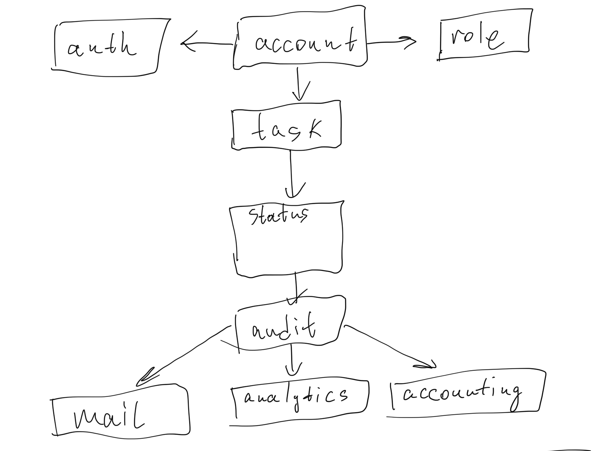
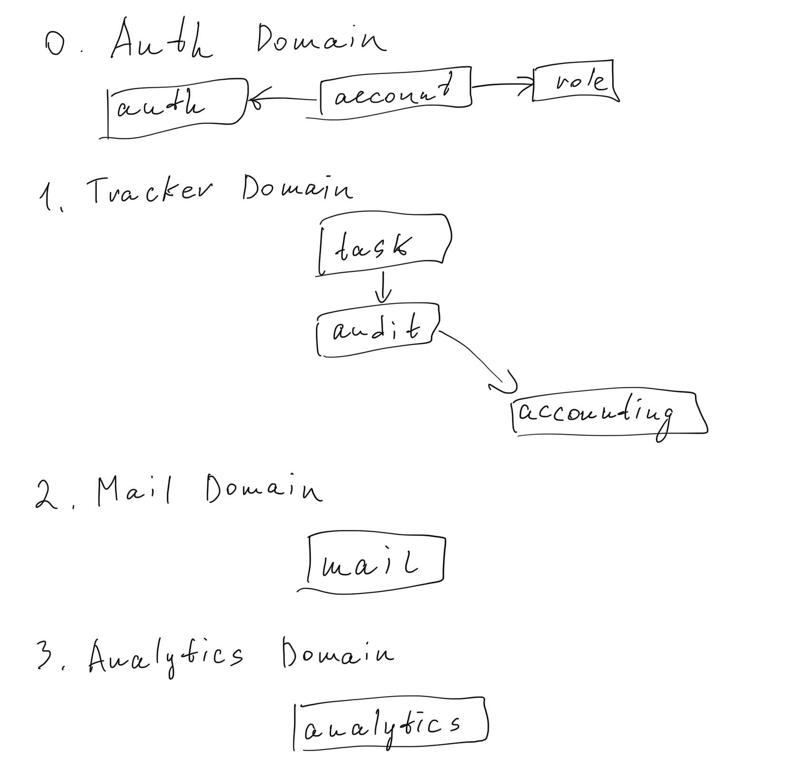
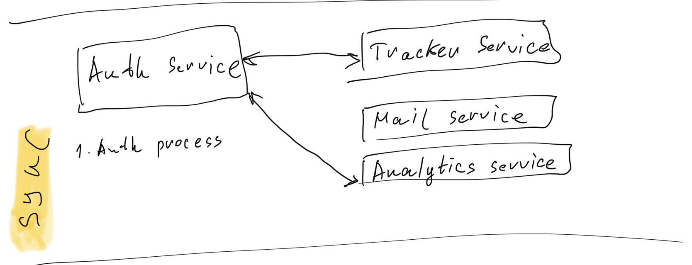
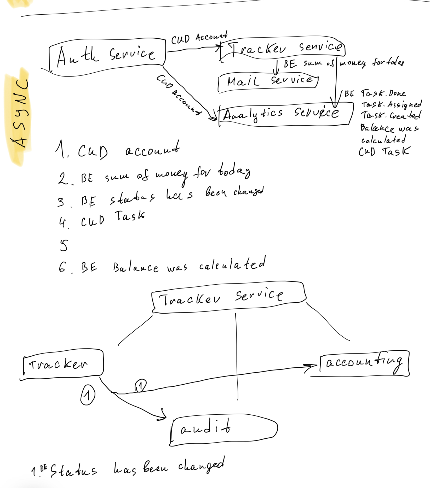

# popug-jira
Architecting complex systems

# Homework 1

## Event storming
Авторизация в таск-трекере должна выполняться через общий сервис авторизации UberPopug Inc (у нас там инновационная система авторизации на основе формы клюва).

actor - account

command - login

data - account

event - 

---
  
Новые таски может создавать кто угодно (администратор, начальник, разработчик, менеджер и любая другая роль). У задачи должны быть описание, статус (выполнена или нет) и попуг, на которого заассайнена задача.

actor - account with any role

command - create task

data - task (description, status) + account public id

event - Task.Created

---

Менеджеры или администраторы должны иметь кнопку «заассайнить задачи»,
которая возьмёт все открытые задачи и рандомно заассайнит каждую на любого из сотрудников (кроме менеджера и администратора) .
Не успел закрыть задачу до реассайна — сорян, делай следующую.

actor - account with role (admin, manager)

command - assign all open tasks to random employee exclude manager and admin

data - account public id, task.status

event - Task.Assigned

---

Каждый сотрудник должен иметь возможность видеть в отдельном месте список заассайненных на него задач + отметить задачу выполненной.

actor - account with any role

command - mark task as done

data - account public id, task.status

event - Task.Assigned, Task.Done

---

У каждого из сотрудников должен быть свой счёт, который показывает, сколько за сегодня он получил денег.
У счёта должен быть аудитлог того, за что были списаны или начислены деньги, с подробным описанием каждой из задач.

actor - Task.Created, Task.Assigned, Task.Done

command - log money

data - account public id, accounting.balance

event - 

---

Изменения баланса сотрудника

actor - Task.Created, Task.Assigned, Task.Done

command - change money amount

data - account public id, accounting.balance

event - Money.Decreased, Money.Increased

---

В конце дня необходимо:
a) считать сколько денег сотрудник получил за рабочий день

actor - system job

command - calc received money for today

data - account public id, accounting.balance

event - Job.Money.CalculatedForToday

---

b) отправлять на почту сумму выплаты.

actor - Job.Money.CalculatedForToday

command - send email

data - account public id, accounting.balance

event -

---

После выплаты баланса (в конце дня) он должен обнуляться

actor - Job.Money.CalculatedForToday

command - set null balance

data - account public id, accounting.balance

event -

---

в аудитлоге всех операций аккаунтинга должно быть отображено, что была выплачена сумма.

actor - Job.Money.CalculatedForToday

command - set that money was sent

data - accountId, audit money sent

event -

---

Нужно указывать, сколько заработал топ-менеджмент за сегодня и сколько попугов ушло в минус.

actor - Task.Done, Task.Assigned

command - set money for a popug

data - accountId, analytics.date, analytics.overall_balance, analytics.popugs_with_minus

event -

## Data model

## Domains

## Sync service communications

## Async service communications

